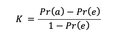

# Kappa Statistik

Die Kappa Statistik passt die accuracy unter Berücksichtigung der Wahrscheinlichkeit einer korrekten Hervorsage durch Zufall an. Sie ist daher vor allem bei Datensätzen, in denen die entsprechende Klasse ungleich verteilt ist von Bedeutung.

*Pr(a)* bezieht sich auf die Proportion von Übereinstimmungen der tatsächlichen und hervorgesagten Werte. *Pr(e)* bezieht sich auf die erwartete Übereinstimmung der Werte unter Annahme, dass diese zufällig gewählt worden sind:

<center>

</center>

Genau wie die accuracy kann die Kappa Statistik aus den in der Kreuztabelle der tatsächlichen und hervorgesagten Werten berechnet werden und wird in dem Output der Funktion *confusionMatrix()* aus dem Package caret angezeigt. Alternativ lässt sich die Kappa mit der Funktion *Kappa()* aus dem Package vcd berechnen.

```{r, echo=T, message=F, warning=F}
library(vcd)
Kappa(table(sms_results$actual_type, sms_results$predict_type))
```